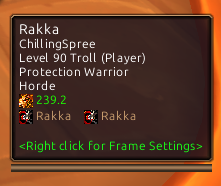

# 🎨 ColorTip

Dynamic (class & reaction) tooltip border, tooltip status bar & tooltip name color.

Players:

- tooltip name is class color
- tooltip border is blend between faction reaction and class color
- tooltip status bar is faction color

Non Player Characters:

- tooltip name is ALREADY reaction color
- tooltip border is reaction color
- tooltip status bar is reaction color

Thanks Slothpala (HealthBarColorTooltip)!
